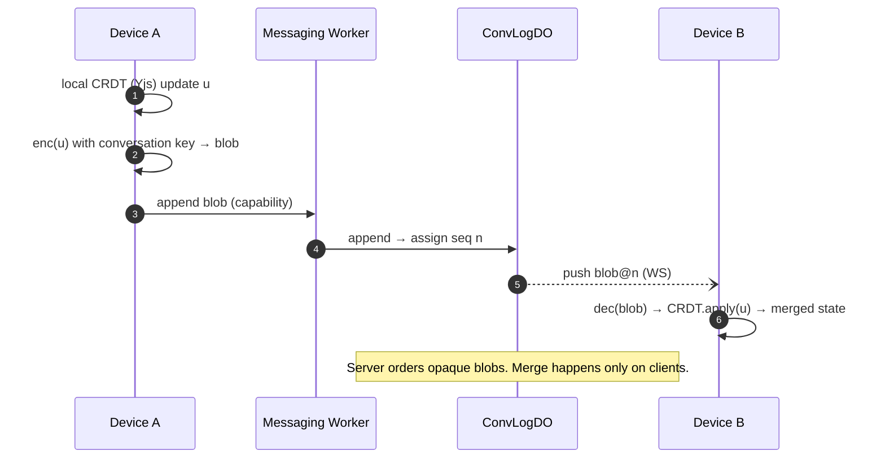
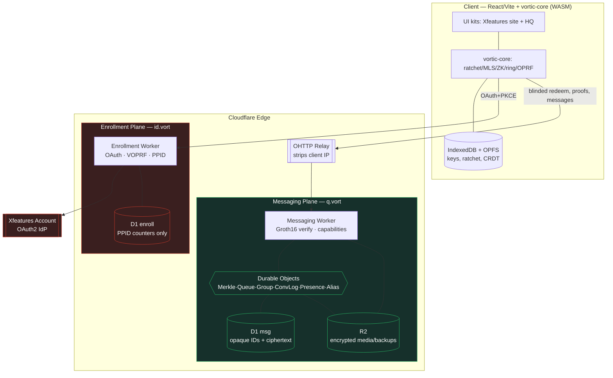

# 04 — Serverless Architecture (Cloudflare)

Everything runs on Workers + Durable Objects + D1 + R2. **No Cloudflare Pub/Sub** — its private beta ended
2025-08-20 and it never reached GA; real-time is Durable Objects + WebSocket Hibernation, with
`@cloudflare/actors` for fan-out patterns.

## Worker/plane separation

Two **separately deployed Workers on different hostnames**, so the planes don't even share a request context:

| Plane | Host (example) | Sees | Bindings |
|---|---|---|---|
| **Enrollment** | `id.vort.xfeatures.net` | OAuth token, email, PPID | `DB_ENROLL` (D1), RSABSSA issuer secret key (`sk_issuer`), PPID secret |
| **Messaging** | `q.vort.xfeatures.net` (behind **OHTTP relay**) | opaque IDs + ciphertext only | `DB_MSG` (D1), `MEDIA` (R2), all DOs |

The Messaging Worker has **no binding** that could reach email/PPID, and — as of the RSABSSA Plane Bridge
(2026-07, see [03](03-crypto-core.md) §2) — no binding that could reach `sk_issuer` either: it knows only
`pk_issuer`, hardcoded as a plain source constant (`workers/messaging/src/issuer-keys.ts`), not a secret
binding or env var, because a public key carries no confidentiality requirement. The Enrollment Worker has
**no binding** to queues/messages. Enforced by separate `wrangler` configs + CI check
(`scripts/schema-lint.mjs`, which also now rejects any secret-shaped `[vars]` entry in either config —
`OAUTH_CLIENT_SECRET`, `PPID_HMAC_SECRET`, `ISSUER_SIGNING_KEY_PEM`, and `SESSION_SIGNING_KEY` all live in
`.dev.vars`/`wrangler secret put`, never a committed `[vars]` value).

## Durable Object catalog

| DO | Sharding key | Responsibility | Hibernates? |
|---|---|---|---|
| `MerkleTreeDO` | group id | Authoritative Lean IMT; insert commitments; serve root; nullifier set | on idle |
| `QueueDO` | rotating queue id | One unidirectional pairwise queue; push/subscribe/TTL-delete | **yes (WS Hibernation)** |
| `GroupDO` | group id | MLS Delivery Service: order Commit/Application ciphertext, fan-out | yes |
| `ConvLogDO` | conversation id | Sequence + fan-out encrypted CRDT op-log | yes |
| `PresenceDO` | contact-scoped | Ephemeral presence/typing (sealed, opt-in) | yes |
| `RateGateDO` | epoch bucket | Nullifier + capability issuance rate limits | on idle |
| `AliasDO` | `H(nickname)` shard-prefix | Opt-in `@alias → intro-queue` records (hashed key, AEAD value); verify PoW; spent-stamp set | on idle |

WebSocket **Hibernation** is the cost keystone: thousands of idle subscribers stay connected while the DO is
evicted from memory and accrues **no duration billing** until a message arrives.

---

## Flow 1 — Registration: OAuth → RSABSSA redemption token → ZK commitment → D1

**Airlock mechanism updated 2026-07** (see [03](03-crypto-core.md) §2, [06](06-roadmap-and-risks.md) Plane
Bridge entry): RSA Blind Signatures (RFC 9474) replaced VOPRF specifically so the `M->>M: Verify(...)` step
below is a real, third-party signature check against `pk_issuer` — no shared secret between E and M, ever.

```mermaid
sequenceDiagram
    autonumber
    participant C as Client (TS/WASM)
    participant IdP as Xfeatures Account
    participant E as Enrollment Worker / Issuer
    participant DE as D1 (enroll)
    participant O as OHTTP Relay
    participant M as Merkle DO
    participant DM as D1 (msg)

    Note over C,IdP: Real-identity zone
    C->>IdP: OAuth2 + PKCE (authorize)
    IdP-->>C: auth code
    C->>E: code + verifier
    E->>IdP: token exchange (client_secret)
    IdP-->>E: access_token
    E->>IdP: /userinfo
    IdP-->>E: {sub, email, email_verified}
    E->>E: PPID = HMAC(secret, sub)
    E->>DE: upsert PPID counter (sybil guard) — NO email, NO handle
    Note over C,E: The airlock (RSA Blind Signature, RFC 9474)
    C->>C: msg ← random identity message; (blinded, state) = Blind(pk_issuer, msg)
    C->>E: POST /token/issue { blinded }
    E->>E: blindSig = BlindSign(sk_issuer, blinded) — sybil guard NOT re-checked (already done above)
    E-->>C: blindSig
    C->>C: sig = Finalize(pk_issuer, state, blindSig, msg)  (self-verifies)
    Note over C,M: Anonymity zone — later, via OHTTP, ideally over VPN
    C->>C: Semaphore id → commitment = Poseidon(pk)
    C->>O: POST /membership/insert { msg, sig, msgRandomizer, commitment }
    O->>M: (IP stripped)
    M->>M: Verify(pk_issuer, msg, msgRandomizer, sig) — REAL signature check, pk_issuer only, no shared secret
    M->>M: tokenNull = H(msg); check issuer_token_null (replay guard) · LeanIMT.insert
    M->>DM: persist leaf + new root
    M-->>C: merkleRoot, leaf index
    Note right of DM: D1(msg) now holds an anonymous commitment + issuer_token_null.<br/>No path back to sub/email exists. spent_tokens is NOT in DB_ENROLL (see D1 schema below).
```

## Flow 2 — Session auth: Semaphore proof → WASM verify → capability

```mermaid
sequenceDiagram
    autonumber
    participant C as Client
    participant O as OHTTP Relay
    participant W as Messaging Worker
    participant R as RateGate DO
    C->>C: epoch = ⌊now/3600⌋; extNull = H(epoch)
    C->>C: Groth16 prove {root, nullifierHash, signal, extNull}
    C->>O: proof + public inputs
    O->>W: (IP stripped) proof
    W->>W: WASM Groth16 verify (~10–50ms target / 0.8s snarkjs)
    W->>R: check nullifierHash unused this epoch
    R-->>W: ok (record nullifier)
    W-->>C: capability = MAC(scope, epoch)  ← cheap auth for all further calls
    Note over C,W: All subsequent messaging uses the capability. ZK is NOT re-run per message.
```

## Flow 3 — Send a 1:1 message (Sealed Sender++ over pairwise queue)

```mermaid
sequenceDiagram
    autonumber
    participant S as Sender
    participant W as Messaging Worker
    participant Q as QueueDO (A→B, rotating id)
    participant R as Recipient
    S->>S: ratchet.encrypt(msg) → ct; seal sender; pad to bucket
    S->>W: PUT /q/{queueId}  (capability, ct)  [via OHTTP]
    W->>Q: append(ct, ttl)
    Q-->>W: seq
    Q--)R: WS push (if subscribed) / else pull on wake
    R->>R: ratchet.decrypt → plaintext
    R->>R: schedule padded+delayed receipt on the B→A receipt queue
    Note over Q: DO sees: opaque queueId, ciphertext, size-bucket. Nothing else.
```

## Flow 4 — Multi-device state sync (encrypted CRDT op-log)



## Flow 5 — Register an opt-in public alias

Everything here runs in the **Messaging Plane**, authorized only by the anonymous session capability — the
Enrollment Plane / `DB_ENROLL` is never touched, so the host cannot learn who owns `@nick`.

```mermaid
sequenceDiagram
    autonumber
    participant C as Client (holds capability)
    participant O as OHTTP Relay
    participant W as Messaging Worker
    participant A as AliasDO (shard = H(nick) prefix)
    participant Q as intro QueueDO
    C->>C: pick @nick; alias_key ← Ed25519; new intro_queue_id
    C->>C: lookup_key = H("v1"||nick)
    C->>C: record = AEAD(HKDF(nick), {intro_queue_id, alias_pub, flags, pow_bits})
    C->>C: mint registration PoW (24–26 bits, resource=lookup_key)
    C->>O: register{lookup_key, record, alias_pub, PoW, sig(alias_key)} (capability)
    O->>W: (IP stripped)
    W->>W: verify capability · verify PoW · verify sig(alias_key)
    W->>A: if lookup_key free → store(lookup_key → record); else → 409 taken
    A-->>C: ok — alias live
    C->>Q: provision & subscribe intro queue (WS Hibernation)
    Note over A: DO holds H(nick) → ciphertext + alias_pub.<br/>No identity, no email/PPID, no link to owner's real queues.
```

## Flow 6 — Resolve a contact & send a request (PoW-gated)

```mermaid
sequenceDiagram
    autonumber
    participant S as Sender (holds capability)
    participant O as OHTTP Relay
    participant W as Messaging Worker
    participant A as AliasDO
    participant Q as intro QueueDO
    participant R as Alias owner
    S->>S: knows @nick → lookup_key = H("v1"||nick)
    S->>S: mint resolve PoW (18–22 bits, resource=lookup_key, epoch)
    S->>O: resolve{lookup_key, PoW} (capability)
    O->>W: (IP stripped)
    W->>W: verify capability · verify PoW · check stamp unspent
    W->>A: get(lookup_key)
    A-->>S: record (ciphertext) + alias_pub
    S->>S: HKDF(nick) → decrypt record → {intro_queue_id, alias_pub}
    S->>S: sealed contact-req (return-queue offer + prekey bundle), encrypted to alias_pub
    S->>S: mint write PoW (20–24 bits, resource=intro_queue_id)
    S->>O: PUT /q/{intro_queue_id} {sealed req, PoW}
    O->>W: (IP stripped)
    W->>Q: verify PoW · check stamp unspent · append(sealed req, ttl)
    Q--)R: deliver on wake
    R->>R: decrypt · APPROVE or ignore
    R-->>S: on approve → bootstrap rotating pairwise queues (leave the alias plane)
    Note over Q: Reaching an alias ≠ reaching the person.<br/>Owner-approval gates contact; ongoing chat uses rotating pairwise queues, never the alias.
```

## Topology (bird's eye)



Red = touches real identity (isolated). Green = anonymity plane (opaque + ciphertext only).

---

## D1 schema (zero PII)

### `DB_ENROLL` (Enrollment Plane) — the only place any identity residue lives
```sql
-- One-way pseudonym + counters ONLY. No email, no handle, no commitment.
CREATE TABLE enroll_ppid (
  ppid          TEXT PRIMARY KEY,        -- HMAC(secret, oauth_sub); irreversible
  enroll_count  INTEGER NOT NULL DEFAULT 0,
  last_epoch    INTEGER NOT NULL,
  created_at    INTEGER NOT NULL
);
```
**Bugfix (2026-07):** this used to also define `spent_tokens` (the redemption-token replay guard) — that was
a real bug: the check belongs in the Messaging Plane (this file's own Flow 1 diagram has always shown
`M->>M: verify · check spend-nullifier`), and keeping it in DB_ENROLL implied Enrollment must participate in
every redemption, a runtime coupling that's exactly the timing/IP-correlation risk [03](03-crypto-core.md) §2
flags as residual and tries to minimize — not something to build into the schema. It has been dropped (see
`workers/enrollment/migrations/0002_drop_spent_tokens.sql`); the real replay guard now lives in DB_MSG as
`issuer_token_null` below. `scripts/schema-lint.mjs` now fails the build if `spent_tokens` reappears in any
enrollment-plane migration.

### `DB_MSG` (Messaging Plane) — no column can hold PII or a cross-plane join key
```sql
CREATE TABLE merkle_nodes (           -- Lean IMT mirror (DO is authoritative)
  group_id  TEXT, idx INTEGER, level INTEGER, hash TEXT,
  PRIMARY KEY (group_id, level, idx)
);
CREATE TABLE group_roots (
  group_id  TEXT, root TEXT, epoch INTEGER, created_at INTEGER,
  PRIMARY KEY (group_id, epoch)
);
CREATE TABLE nullifiers (             -- per-epoch session/anti-sybil nullifiers (Flow 2, ZK session)
  external_nullifier TEXT, nullifier_hash TEXT, epoch INTEGER,
  PRIMARY KEY (external_nullifier, nullifier_hash)
);
CREATE TABLE issuer_token_null (       -- redemption-token replay guard (Flow 1, RSABSSA) — see the
  token_null TEXT PRIMARY KEY,         -- DB_ENROLL bugfix note above. token_null = H(msg); unlinkable
  spent_at   INTEGER NOT NULL          -- to ppid/commitment/handle. Authoritative enforcement is
);                                     -- MerkleTreeDO's own SQLite (same as `nullifiers` above); this
                                       -- table documents the schema so schema-lint scans it too.
CREATE TABLE queues (                 -- pairwise unidirectional queues
  queue_id   TEXT PRIMARY KEY,        -- rotating opaque 128-bit
  created_at INTEGER, rotates_at INTEGER
);
CREATE TABLE queue_messages (
  queue_id TEXT, seq INTEGER, ciphertext BLOB, size_bucket INTEGER,
  enqueued_at INTEGER, ttl INTEGER,
  PRIMARY KEY (queue_id, seq)
);
CREATE TABLE prekeys (                -- ratchet bootstrap (opaque bundle id)
  bundle_id TEXT PRIMARY KEY, bundle BLOB, kind TEXT, consumed INTEGER DEFAULT 0
);
CREATE TABLE conv_log (               -- encrypted CRDT op-log
  conv_id TEXT, seq INTEGER, blob BLOB, enqueued_at INTEGER,
  PRIMARY KEY (conv_id, seq)
);
CREATE TABLE blobs_meta (             -- R2 pointers for media/backups
  blob_id TEXT PRIMARY KEY, size_bucket INTEGER, created_at INTEGER, ttl INTEGER
);
CREATE TABLE aliases (                -- OPT-IN public discovery; keyed by hash, value encrypted (AliasDO authoritative)
  lookup_key       TEXT PRIMARY KEY,  -- H("vortic-alias-v1" || nickname); host cannot read the nickname from a dump
  record           BLOB NOT NULL,     -- AEAD(HKDF(nickname), {intro_queue_id, alias_pub, flags, pow_bits})
  alias_pub        TEXT NOT NULL,     -- Ed25519; authorizes signed updates/revocation
  pow_bits         INTEGER NOT NULL,  -- per-alias minimum PoW difficulty
  registered_epoch INTEGER NOT NULL
);
CREATE TABLE pow_stamps (             -- replay protection for resolve/write/register PoW
  stamp_hash TEXT, epoch INTEGER, kind TEXT,   -- kind ∈ {resolve, write, register}
  PRIMARY KEY (stamp_hash, epoch)
);
```
**CI invariant:** a `schema-lint` step greps migrations for forbidden columns (`email`, `sub`, `user_id`,
`phone`, `handle`, `ip`, `nickname`) and fails the build if any appears in `DB_MSG`, or if any table joins
`DB_ENROLL` to `DB_MSG`. The `aliases` table may store only `H(nickname)` (`lookup_key`) — a plaintext
`nickname` column fails the build. Two more checks added 2026-07 with the RSABSSA Plane Bridge: (1) a
retired-table-name list per plane, checked against the NET state after applying all of that plane's
migrations in order (so `CREATE`-then-`DROP` in history doesn't false-positive) — currently just
`spent_tokens` in `DB_ENROLL`, so that exact bug can't be silently reintroduced; (2) any wrangler.toml
`[vars]` entry whose name looks secret-shaped (`/SECRET|KEY|SIGNING|PRIVATE/i`) fails the build — secrets
must be `wrangler secret put` / `.dev.vars` only, never a plaintext `[vars]` value.

---

## Cloudflare limits & how we live within them

| Limit | Value | Design response |
|---|---|---|
| Worker memory | 128 MB/isolate (incl. WASM) | Verifier-only WASM on edge; keep circuits small; stream media |
| Worker CPU | 30 s default, up to **5 min** (paid) | ZK verify once/session; heavy proving is **client-side only** |
| DO storage (SQLite) | 10 GB/DO (paid) | Shard queues/logs per-conversation; TTL-evict delivered ciphertext |
| WS Hibernation | idle sockets ~free | Presence/queue subscribers hibernate |
| D1 | SQLite semantics, size caps | D1 is the durable mirror; DO SQLite is hot path; blobs go to R2 |
| R2 | S3-compatible, presigned, no egress fee | Direct client↔R2 for media; Worker never proxies bytes |

**Sources:** [DO limits](https://developers.cloudflare.com/durable-objects/platform/limits/) ·
[WS Hibernation](https://developers.cloudflare.com/durable-objects/best-practices/websockets/) ·
[Workers limits](https://developers.cloudflare.com/workers/platform/limits/) ·
[Pub/Sub retirement](https://developers.cloudflare.com/pub-sub/) ·
[Cloudflare OHTTP / Privacy Gateway](https://developers.cloudflare.com/privacy-gateway/).
